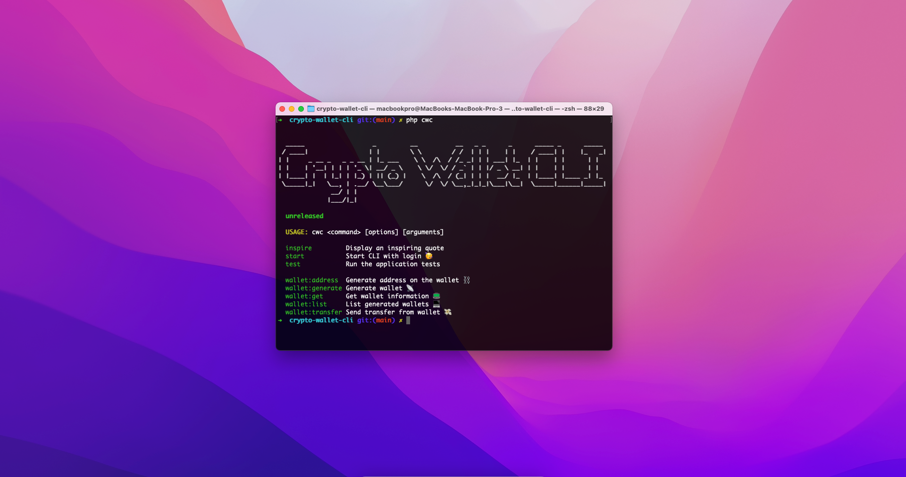
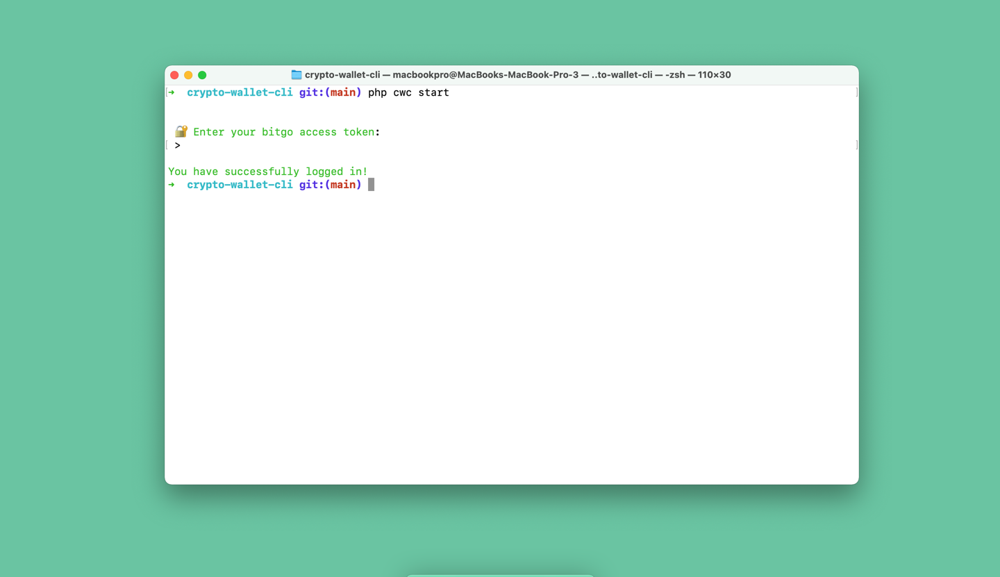
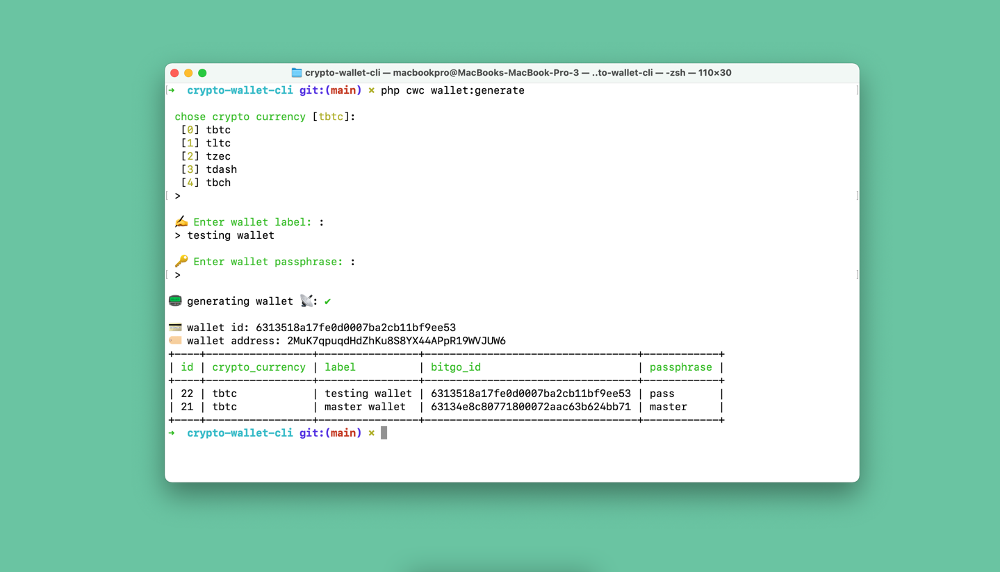
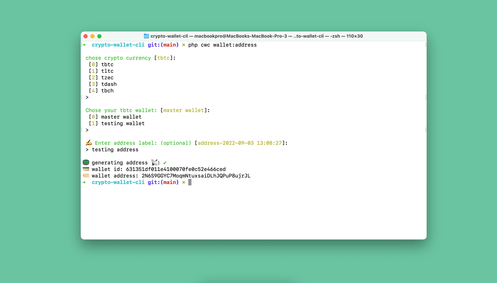
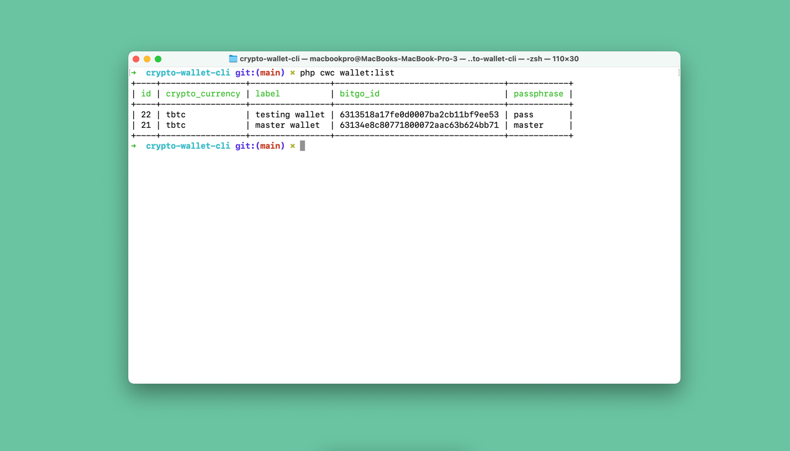
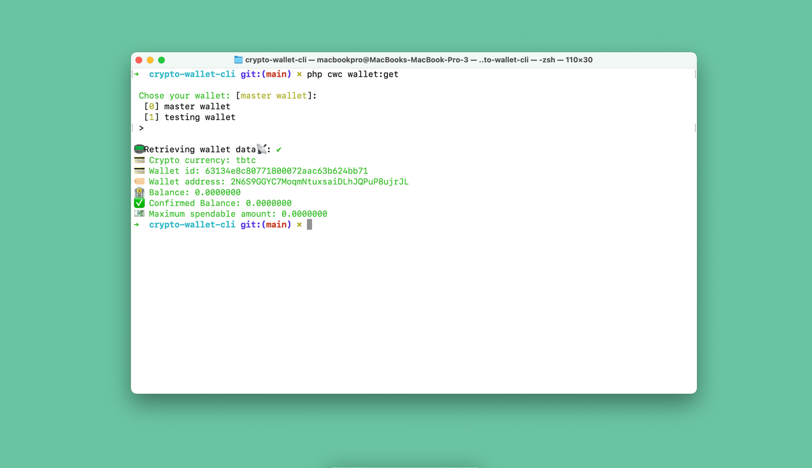
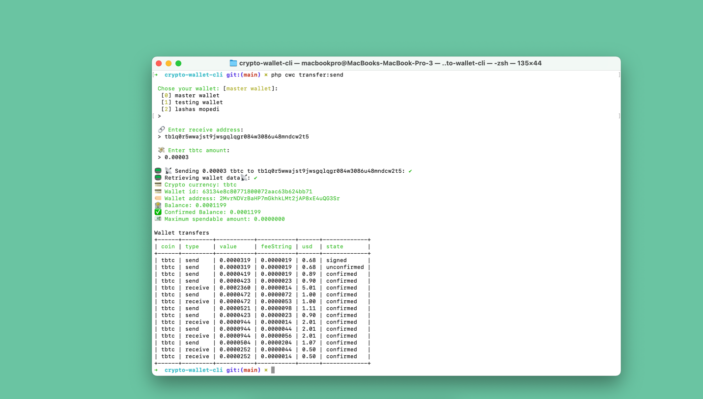

<p align="center">
    
</p>

##  CLI tool for Bitgo crypto wallet
- used package for bitgo integration: https://github.com/KhomerikiK/laravel-bitgo-wallet
## requirements
- php 8

## setup
```bash
composer install
php cwc migrate

cp .env.example .env
```

# usage

## 1) Start


## 2) Generate wallets


## 3) Generate address


## 4) List wallets


## 5) Get wallet info


## 6) Send Transfer

